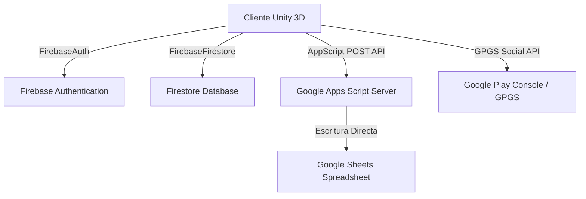
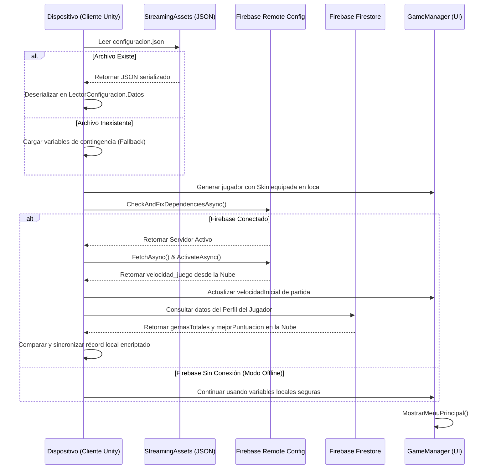
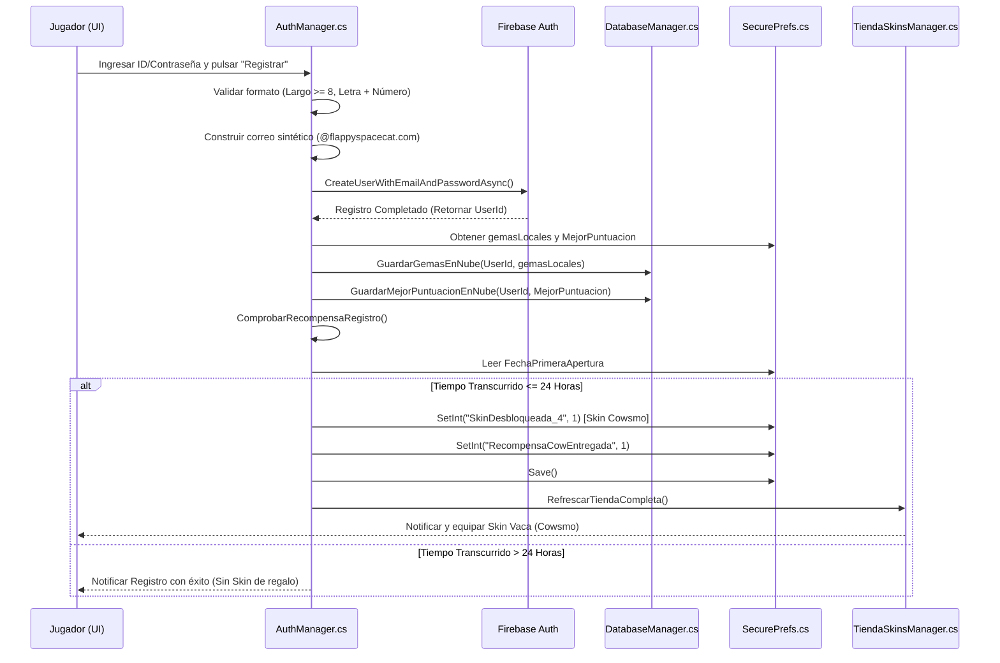

# ARCHITECTURE DESIGN DOCUMENT (ADD)
## FLAPPY SPACE CAT

---

## 1. ESTRUCTURA DE ESCENA ÚNICA (CANVAS-BASED ARCHITECTURE)

Para optimizar el rendimiento, reducir los tiempos de carga y evitar el consumo excesivo de memoria RAM (Garbage Collector) en dispositivos de gama baja, **Flappy Space Cat** adopta una arquitectura de **Escena Única**.

```
[Escena Activa: Escena_Juego]
  ├── Cámara Principal (Camera.main)
  ├── GameManager (Singleton Global, Persistente)
  ├── FirebaseManager (Singleton, Inicialización de Dependencias)
  ├── PublicidadManager (Singleton, AdMob API)
  ├── LogrosManager (Singleton, GPGS Social API)
  ├── Canvas (UI Principal - Escala Responsive 1920x1080)
  │     ├── Panel_MenuPrincipal (Menú Principal, Título, Play)
  │     ├── Panel_Gameplay (Contadores de Puntos y Gemas activos)
  │     ├── Panel_Pausa (Opciones de volumen, botón de reanudación)
  │     ├── Panel_GameOver (Récords, Botón Revivir con Cuenta Atrás)
  │     ├── Panel_Tienda (Scroll dinámico de skins estéticas)
  │     └── Panel_InicioSesion (Formulario de registro y Google Login)
  └── Punto_Aparicion_Jugador (Pivote responsivo para instanciar Skins)
```

### 1.1. Gestión de Estados por Desactivación Jerárquica
En lugar de cargar y descargar escenas complejas con `SceneManager.LoadScene`, el `GameManager.cs` actúa como un coordinador de estados de la interfaz de usuario. Las transiciones entre menús y la fase activa de juego se logran activando y desactivando de forma atómica los GameObjects de los paneles dentro del Canvas principal:
* **Estado de Menú Principal**: Se activa `Panel_MenuPrincipal`, se desactiva `Panel_Gameplay` y se establece `Time.timeScale = 0f` (pausando físicas y simulaciones de partículas en segundo plano).
* **Estado de Gameplay**: Se desactiva `Panel_MenuPrincipal`, se activa `Panel_Gameplay` e interactivos y se establece `Time.timeScale = 1f`.
* **Estado de Pausa**: Se interrumpe el flujo estableciendo `Time.timeScale = 0f` y superponiendo el `Panel_Pausa` de forma no invasiva.

---

## 2. ARQUITECTURA EN LA NUBE E INTEGRACIÓN HÍBRIDA

El ecosistema del juego interactúa asíncronamente con servicios en la nube para garantizar la persistencia, seguridad e integridad del progreso del jugador.



### 2.1. Autenticación Robusta (AuthManager.cs)
El acceso de usuarios se realiza mediante **Firebase Authentication**. Se admiten dos flujos:
1. **Google Sign-In**: Autenticación federada utilizando el token ID devuelto por el framework de Google en Android.
2. **Registro e Inicio por Credenciales (Email/Password)**: 
   * *Username Fallback*: Para agilizar el proceso y evitar que los usuarios tengan que recordar correos electrónicos, se les permite introducir un identificador único (Username). El script `AuthManager.cs` inyecta de forma interna e invisible el dominio sintético `@flappyspacecat.com` para cumplir con las políticas de formato de Firebase:

$$\text{emailFirebase} = \text{idUsuario} + \text{"@flappyspacecat.com"}$$

   * *Validaciones Locales*: El cliente valida localmente antes de conectar que la contraseña tenga mínimo 8 caracteres, al menos una letra y un número, y que el ID no contenga espacios en blanco, reduciendo el tráfico y la sobrecarga de consultas en Firebase.

### 2.2. Base de Datos Orientada a Documentos (DatabaseManager.cs)
Una vez autenticado el jugador, se asocia su ID única (`UserId`) a un documento persistente dentro de la colección **"Jugadores"** en **Firebase Firestore**. El documento contiene la siguiente estructura de campos estructurados en JSON:

```json
{
  "gemasTotales": 540,
  "mejorPuntuacion": 125,
  "ultimaConexion": "FieldValue.ServerTimestamp"
}
```

* **Operación de Escritura Segura (Merge)**:
  Para evitar que una sincronización de datos parcial sobrescriba y elimine otros campos del perfil del jugador, las transacciones se realizan bajo la directiva de fusión total:

$$\text{DocumentReference.SetAsync}(\text{datosUsuario}, \text{SetOptions.MergeAll})$$

### 2.3. Servidor Intermediario en Google Apps Script (Voluntario)
Para dar cumplimiento estricto a los requisitos opcionales del servidor e integrarlo directamente con la exigencia docente de **exportar los registros de actividades y tiempos personales a un Google Sheets**, se ha diseñado una arquitectura basada en **Google Apps Script** que actúa como API Gateway secundaria:

1. El cliente Unity realiza una petición POST de forma asíncrona mediante `UnityWebRequest` hacia la URL pública de la aplicación web creada en Google Apps Script.
2. El cuerpo de la petición envía el progreso formateado en JSON:
```json
{
  "idUsuario": "firebase_uid_123",
  "gemas": 120,
  "record": 45,
  "fecha": "2026-06-02T18:00:00"
}
```
3. El script de Google Apps Script procesa la petición HTTP y escribe de forma estructurada en un libro de **Google Sheets** compartido en tiempo real con el profesor, registrando la progresión de los alumnos y las puntuaciones para su auditoría automática.

---

## 3. RESILIENCIA ONLINE/OFFLINE (HYBRID SAVING LOGIC)

Una especificación crítica de los requerimientos es: *"El servidor en todo momento se podrá desactivar y el juego podrá seguir funcionando incluso sin conexión"*. Para lograr esto, se ha programado una arquitectura de **Caché y Sincronización Diferida**:

```
[Inicio de Sesión]
       │
       ▼
¿Hay Red Activa y Firebase Disponible?
 ├── SÍ ➔ Descarga gemas/récords de Firestore ➔ Sobrescribe PlayerPrefs
 └── NO ➔ Lee PlayerPrefs local directo ➔ Permite jugar sin interrupciones
       │
       ▼
[Durante el Gameplay / Muerte]
       │
       ▼
¿Hay Sesión Firebase Activa?
 ├── SÍ ➔ Escribe en Local (SecurePrefs) + Sincroniza en Firestore (Merge)
 └── NO ➔ Escribe ÚNICAMENTE en Local (SecurePrefs)
       │
       ▼
[Recuperación de Red en Menú Principal]
 Sincronización Diferida asíncrona asocia datos locales a la cuenta y sube.
```

### 3.1. Encriptación de Datos Locales (SecurePrefs.cs)
Dado que los datos deben persistirse de forma local al jugar offline, existe el riesgo de que los usuarios alteren de forma fraudulenta los archivos XML de `PlayerPrefs` en Android (ubicados en `/data/data/.../shared_prefs/`) o en el Registro de Windows para inyectarse gemas ilimitadas. 

Para evitarlo, se ha implementado el helper **`SecurePrefs.cs`**. Este módulo actúa como envoltorio sobre los métodos de persistencia nativos de Unity, aplicando un algoritmo de cifrado simétrico **AES-256** acoplado con una firma hash **SHA-256** que asocia los datos al identificador único del hardware del dispositivo. Cualquier modificación manual externa de las gemas corrompe el hash y el juego la detecta, restableciendo el perfil de contingencia y garantizando la viabilidad económica del producto.

---

## 4. SISTEMA DE CONFIGURACIÓN DINÁMICA (EL PARSER)

El juego cuenta con un doble motor de inyección de parámetros para alterar el comportamiento en caliente:

### 4.1. Parser JSON Local (LectorConfiguracion.cs)
Durante la inicialización (`Awake`), el script localiza el archivo físico `configuracion.json` alojado en la carpeta de activos precompilados de Unity (`Application.streamingAssetsPath`):
1. **Acceso al Archivo**: Se comprueba la existencia mediante `File.Exists`.
2. **Proceso de Parseo**: Se lee la cadena de texto completa y el parser nativo de Unity la deserializa en un objeto de clase fuerte `DatosJuego`:

$$\text{LectorConfiguracion.Datos} = \text{JsonUtility.FromJson<DatosJuego>}(\text{contenidoJson})$$

3. **Valores de Contingencia (Fallback)**: Si ocurre una excepción I/O (archivo borrado por el usuario), el catch del parser inyecta de inmediato un perfil de contingencia seguro en memoria (`velocidadJuego = 4f`, `gravedadJugador = 1.5f`) para que la aplicación nunca experimente un bloqueo (*Crash*).

### 4.2. Servidor de Parámetros (Firebase Remote Config)
En paralelo a la carga local, el script `RemoteConfigManager.cs` inicia una comunicación en segundo plano con la consola de Firebase:
1. **Configuración por Defecto**: Se asocian las variables locales mediante `SetDefaultsAsync`.
2. **Descarga Asíncrona con Latencia Cero**: Se realiza un `FetchAsync(TimeSpan.Zero)` indicando al servidor que omita la memoria caché y fuerce la descarga de los parámetros actualizados en caliente.
3. **Aplicación Dinámica**: Al completarse la descarga y activación, se lee el campo `"velocidad_juego"`. Si en la consola web de Firebase se ha modificado la constante de velocidad de `4.0` a `5.0`, el script sobrescribe dinámicamente las propiedades del `GameManager` al instante, mutando la velocidad del runner sin obligar al usuario a actualizar el juego en la tienda.

---

## 5. DIAGRAMAS DE FLUJO Y SECUENCIA (MERMAID)

### 5.1. Secuencia de Inicio de Aplicación y Sincronización
El siguiente diagrama detalla cómo interactúan los sistemas en el arranque de la aplicación:



### 5.2. Secuencia de Registro y Otorgamiento de Recompensa
Proceso por el cual un jugador crea su cuenta tras su primera partida y recibe la skin de Cowsmo si cumple el plazo de 24 horas:


