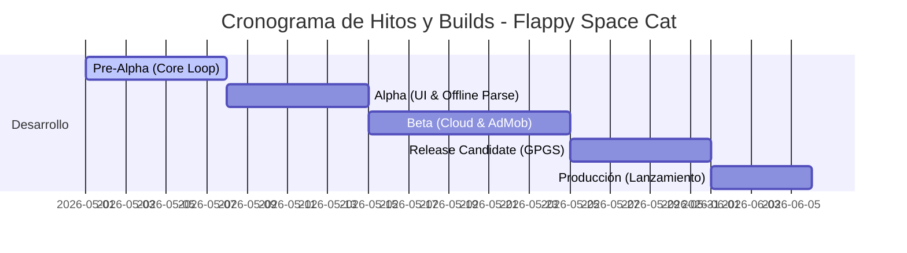

# CALENDARIO DE ENTREGAS Y BUILDS
## FLAPPY SPACE CAT

---

Para cumplir con las exigencias del proyecto y garantizar una entrega ordenada sin el uso de la metodología Scrum, **Flappy Space Cat** se ha desarrollado bajo un modelo clásico de **Hitos por Versión (Milestones)**. Cada hito produce una *Build* estable, con objetivos funcionales claros y pruebas de Aseguramiento de Calidad (QA) específicas.

---

## 1. DESGLOSE CRONOLÓGICO DE HITOS Y ENTREGAS

### 1.1. Build 1.0.0 (Hito Pre-Alpha - Core Loop Funcional)
* **Objetivo**: Desarrollar la física base del juego y la jugabilidad inmediata (*Core Loop*).
* **Funcionalidades Entregadas**:
  * Implementación física del impulso del gato en `ControladorJugagor.cs`.
  * Generación procedural y constante de obstáculos (meteoritos).
  * Movimiento infinito por scrolling y fondo parallax básico en 2D.
* **Plataformas de Prueba**: Editor de Unity y PC (Windows build).
* **Metodología de QA (Pruebas)**:
  * Pruebas de caja negra: Comprobación del retardo de entrada (*Input Lag*) al hacer clic y validar la fuerza de salto vertical.
  * Pruebas de límites: Asegurar que el gato no pueda sobrepasar la pantalla por arriba ni caer indefinidamente por abajo.

---

### 1.2. Build 1.1.0 (Hito Alpha - Interfaz de Usuario y Persistencia Local)
* **Objetivo**: Diseñar la estética del juego, los menús de transición y el sistema de almacenamiento local seguro.
* **Funcionalidades Entregadas**:
  * Estructura de escena única con Canvas y controladores de eventos dinámicos.
  * Parser JSON local en `LectorConfiguracion.cs` leyendo desde `StreamingAssets`.
  * Integración de `SecurePrefs.cs` con encriptación AES-256 para el guardado local de gemas y récords.
  * Interfaz de la Tienda de Skins con scroll responsivo y tarjetas dinámicas.
* **Plataformas de Prueba**: Windows PC y WebGL.
* **Metodología de QA (Pruebas)**:
  * Auditoría de Encriptación: Intentar modificar manualmente las gemas editando los registros locales de preferencias. Confirmar que el sistema detecta la alteración del hash SHA-256 y activa de inmediato los valores por defecto de contingencia.
  * Pruebas del Parser: Forzar fallos de lectura borrando o corrompiendo el archivo `configuracion.json` y verificar que el juego arranca sin bloqueos (*Crashes*) usando el fallback en memoria.

---

### 1.3. Build 1.2.0 (Hito Beta - Integración en la Nube y Monetización)
* **Objetivo**: Conectar el juego a servicios de internet activos, implementar la base de datos distribuida y monetizar el producto.
* **Funcionalidades Entregadas**:
  * Inicialización asíncrona de dependencias de Google Play Services en `FirebaseManager.cs`.
  * Registro y logueo mediante credenciales personalizadas (correo sintético) y Google Login en `AuthManager.cs`.
  * Sincronización asíncrona diferencial con Firebase Firestore en `DatabaseManager.cs`.
  * Integración con Firebase Remote Config para alterar la velocidad base de juego en caliente.
  * Implementación del SDK de Google AdMob en `PublicidadManager.cs` (Banner superior, Intersticial dinámico y Reward Videos con flujos de gemas y resurrección).
* **Plataformas de Prueba**: WebGL, PC Windows y primer despliegue móvil en **Android (APK)**.
* **Metodología de QA (Pruebas)**:
  * **Auditoría de Contingencia Offline**: Desconectar el adaptador de red del dispositivo a mitad de una partida activa. Jugar en modo local, acumular gemas y morir. Confirmar que el progreso se almacena localmente de forma encriptada. Reconectar la red al volver al menú principal y verificar que se realiza la sincronización differential en la base de datos de Firestore en segundo plano de manera limpia y sin fricciones.
  * Pruebas del Remote Config: Modificar el parámetro `"velocidad_juego"` en la consola web de Firebase y comprobar la aplicación inmediata al iniciar una partida en el terminal Android.

---

### 1.4. Build 1.3.0 (Hito Release Candidate - Servicios Sociales de Plataforma)
* **Objetivo**: Conectar las APIs sociales de Google Play y asegurar la adaptabilidad total para la subida a tiendas.
* **Funcionalidades Entregadas**:
  * Integración técnica con Google Play Games Services (GPGS).
  * Autenticación silenciosa al arrancar la aplicación móvil.
  * Sistema de 20 Logros oficiales del juego reportados a través de `Social.ReportProgress`.
  * Marcadores online de records (Leaderboards).
  * Auditoría de adaptabilidad de UI en múltiples resoluciones móviles reales.
* **Plataformas de Prueba**: **Android (Bundle AAB)** e **iOS (Xcode/Simulator)**.
* **Metodología de QA (Pruebas)**:
  * Pruebas de Regresión Social: Iniciar sesión en un dispositivo Android de prueba, confirmar el banner flotante de bienvenida de Google Play Games y verificar la asignación correcta del logro *Primeros Pasos* al superar el primer obstáculo.
  * Auditoría Responsive: Ejecutar el juego en terminales con pantallas ultra-panorámicas (como 21:9 o tablets 4:3). Comprobar que los Anchors del Canvas evitan que los botones de pausa o marcadores queden recortados o fuera de pantalla.

---

### 1.5. Build 2.0.0 (Hito Producción - Lanzamiento y LiveOps)
* **Objetivo**: Publicar el juego a nivel global y monitorizar el comportamiento financiero y técnico en producción.
* **Funcionalidades Entregadas**:
  * Subida oficial de la versión definitiva optimizada a Google Play Store en el canal de producción.
  * Activación de campañas de marketing viral en TikTok y adquisición orgánica.
  * Activación del API de exportación en Google Apps Script para almacenar telemetría de rendimiento directamente en el Google Sheets del docente.
* **Plataformas de Destino**: **Android (Google Play)**, **Navegadores Web (WebGL)** y **PC (Tiendas de escritorio / Itch.io)**.
* **Metodología de QA (Pruebas)**:
  * Monitorización de analíticas integradas en Firebase Console para detectar caídas de retención o bloqueos mediante Crashlytics en caliente.

---

## 2. MATRIZ DE CRONOGRAMA DE ENTREGAS Y CONTINGENCIA DE QA

Para asegurar el control del proyecto y justificar el esfuerzo individual, se establece la siguiente matriz de entregables y comprobaciones:

| Build / Versión | Entregable Principal | Riesgo Identificado | Plan de QA de Contingencia |
| :--- | :--- | :--- | :--- |
| **1.0.0 (Pre-Alpha)** | Core Loop (.exe) | El salto del gato se siente tosco o impreciso. | Pruebas de usabilidad física con testers externos para ajustar la gravedad. |
| **1.1.0 (Alpha)** | UI & Persistencia Local | El usuario puede alterar los datos locales y obtener 99999 gemas. | Auditoría de hashing encriptado local (`SecurePrefs.cs`) y borrado preventivo. |
| **1.2.0 (Beta)** | Firebase & AdMob APK | Google AdMob no carga los anuncios debido a la latencia de red. | Inyección de callbacks de reanudación automática si el anuncio falla al cargar. |
| **1.3.0 (RC)** | GPGS & Android AAB | La autenticación silenciosa de Google Play Games falla en algunos móviles. | Control con try/catch en el arranque para permitir jugar en modo invitado local offline. |
| **2.0.0 (Production)** | Lanzamiento Tiendas | La curva de dificultad es demasiado empinada y causa abandono temprano. | Modificar dinámicamente la velocidad inicial por Remote Config sin recompilar la app. |
