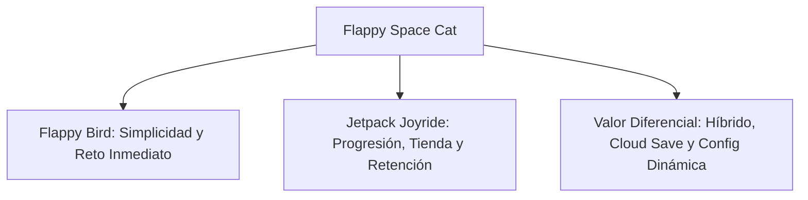

# GAME DESIGN DOCUMENT (GDD)
## FLAPPY SPACE CAT

---

## 1. RESUMEN EJECUTIVO (PITCH DEL PROYECTO)

**Flappy Space Cat** es un videojuego multiplataforma en dos dimensiones (2D) perteneciente al género *Endless Runner* con mecánicas de física de vuelo interactiva. El jugador controla a un gato cosmonauta perdido en el espacio profundo que intenta esquivar obstáculos (meteoritos y escombros estelares) a velocidades progresivas mientras recolecta gemas estelares para adquirir aspectos estéticos en una tienda integrada.

### 1.1. Propuesta de Valor y Viabilidad Académica
Este juego ha sido concebido no solo como un reto recreativo, sino como un **Proyecto de Programación Integral**. Combina el alto rendimiento del motor gráfico **Unity 3D** en su módulo 2D con un ecosistema robusto en la nube basado en **Firebase (Authentication, Firestore Database, Remote Config y Analytics)**, integraciones analíticas externas (**Unity Analytics** y **Game Analytics**), monetización multicanal (**Google AdMob**) e integración de plataformas sociales nativas (**Google Play Games Services**). Esta arquitectura justifica con creces su viabilidad como proyecto de grado, demostrando el dominio de:
* Desarrollo multiplataforma optimizado (Android, iOS, WebGL y Windows PC).
* Flujos asíncronos y concurrencia (Lectura/escritura en bases de datos orientadas a documentos).
* Configuración remota dinámica (Inyección de metadatos en caliente desde servidores externos).
* Sistemas de persistencia híbridos (Sincronización online/offline transparente).

---

## 2. ANÁLISIS DE LA COMPETENCIA Y ESTUDIO DE MERCADO

Para asegurar la rentabilidad del producto final, se ha realizado un estudio comparativo exhaustivo con los dos grandes referentes del mercado móvil en este género:



### 2.1. Competidor 1: Flappy Bird
* **Descripción**: El referente clásico del género *Endless Runner* de un solo toque vertical.
* **Mecánicas**: Impulso vertical simple con gravedad constante. Huecos estáticos entre tuberías.
* **Estilo Visual**: Pixel art 8-bits retro, scrolling horizontal plano, colores primarios sin variabilidad espacial.
* **Monetización**: Banners intrusivos en pantalla activa y anuncios intersticiales obligatorios tras cada muerte.
* **Limitaciones**: Curva de dificultad frustrante desde el segundo 1. Ausencia absoluta de progresión, tienda, skins, logros o persistencia en la nube. Si el usuario desinstala el juego, pierde sus puntuaciones locales de forma irreversible.

### 2.2. Competidor 2: Jetpack Joyride
* **Descripción**: El gigante de Halfbrick Studios que introdujo la progresión profunda en los runner casuales.
* **Mecánicas**: Impulso ascendente continuo mediante pulsación larga. Obstáculos móviles, misiles teledirigidos, monedas flotantes y vehículos especiales.
* **Estilo Visual**: Animación 2D fluida, temática industrial de ciencia ficción, fondos en capas dinámicas (Parallax).
* **Monetización**: Compras integradas de moneda premium, pases de batalla, anuncios rewarded para resucitar y banners opcionales.
* **Fortalezas**: Excelente retención de usuarios a largo plazo gracias a misiones diarias, tienda de skins, mejoras estéticas e imanes de monedas.

### 2.3. Matriz Comparativa y Valor Diferencial de Flappy Space Cat

| Característica | Flappy Bird | Jetpack Joyride | Flappy Space Cat (Nuestro Proyecto) |
| :--- | :--- | :--- | :--- |
| **Dificultad** | Extrema desde el inicio (fija) | Progresiva compleja | **Dinámica temporal** (ajustable por Remote Config en tiempo real) |
| **Persistencia** | Local básica sin seguridad | Servidores propios (Cloud Save) | **Persistencia Híbrida** (Firebase Auth + Firestore y Local Encriptado) |
| **Personalización** | Nula | Alta (Skins de pago) | **Tienda de Skins integrada** (Economía balanceada "Cowsmo", "Orion", etc.) |
| **Monetización** | Intrusiva y molesta | Agresiva (Pay-to-Win) | **Free-to-Play Justo** (AdMob Rewarded + Interstitials con tiempo de gracia) |
| **Logros e Integración** | Nula | Marcadores internos | **20 Logros y Marcadores en Google Play Games Services** |
| **Flexibilidad de Variables** | Código duro (Hardcoded) | Requiere actualización | **Carga dinámica por JSON** local o inyección desde la nube |

**El valor diferencial de Flappy Space Cat** radica en que toma la adicción inmediata y los controles sencillos de *Flappy Bird*, pero los enriquece con el sistema de progresión, recompensas y tienda estética de *Jetpack Joyride*, todo ello soportado por una infraestructura de red moderna y robusta. Esto evita la frustración prematura del jugador, prolonga la retención (gracias a los logros y skins) y maximiza los retornos financieros del desarrollador de forma equilibrada.

---

## 3. GAMEPLAY Y MECÁNICAS DE JUEGO DETALLADAS

### 3.1. Controles de Entrada (Input System)
El juego implementa un esquema de control de un solo botón (*One-Button Game*), asegurando la accesibilidad total en múltiples plataformas:
* **Móvil (Android/iOS)**: Detección táctil por pantalla (`Touch` o `Input.GetMouseButtonDown(0)`).
* **Escritorio (PC Windows/Mac)**: Clic izquierdo del ratón o barra espaciadora.
* **Navegador (WebGL)**: Clic izquierdo del ratón.

Al accionar este control, el script `ControladorJugagor.cs` aplica un impulso vertical instantáneo sobre el vector del componente físico `Rigidbody2D` del personaje:

$$\vec{v}_y = \vec{u}_{vertical} \times \text{fuerzaSalto}$$

El movimiento horizontal es automático y constante, simulado mediante el desplazamiento hacia la izquierda de los fondos parallax (`ControladorFondo.cs`) y los obstáculos instanciados (`MovimientoObjetos.cs`), a fin de evitar cálculos de traslación del jugador y optimizar el rendimiento de colisiones físicas en Unity.

### 3.2. Límites Físicos y Condiciones de Muerte
El juego define dos condiciones letales obligatorias:
1. **Colisión Física Directa**: El personaje choca contra un objeto con tag "Obstaculo" (meteoritos superiores o inferiores) detectado mediante `OnCollisionEnter2D`.
2. **Caída al Vacío o Salida de Pantalla**: El personaje cae fuera del campo visual inferior de la cámara.

**Cálculo Dinámico del Borde Inferior de Muerte**:
Para evitar fallos visuales donde el personaje se detiene en el aire o cae de forma infinita, el script `ControladorJugagor.cs` calcula en su inicio la posición exacta del borde inferior del viewport de la cámara en coordenadas del mundo real:

$$\text{limiteAbajo} = \text{Camera.main.ViewportToWorldPoint}(0, 0, Z) - \text{altoPersonaje} - 2.0f$$

*El margen de 2.0 unidades garantiza que al congelarse el flujo del tiempo tras morir (Time.timeScale = 0), el avatar del gato haya desaparecido por completo de la pantalla, evitando la distorsión estética.*

**Límite Superior Antiescape**:
Se define un límite de vuelo superior rígido (`limiteArriba = 4.5f`). Si el jugador intenta pulsar repetidamente para salir de la pantalla por arriba, el script intercepta su posición:

$$\text{posicion.y} = \min(\text{posicion.y}, \text{limiteArriba})$$

Si su velocidad ascendente es positiva al tocar este límite, se detiene a cero instantáneamente (`rb.linearVelocity = Vector2.zero`), evitando que el jugador esquive obstáculos sobrevolando por encima del área de meteoritos diseñada.

### 3.3. Sistema de Dificultad Progresiva y Dinámica
La dificultad se basa en la velocidad de desplazamiento del escenario (`velocidadActual`), gestionada por el `GameManager.cs`. 
* **Fórmula de Progresión Temporal**:

$$\text{velocidadActual} = \text{velocidadInicial} + \left( \lfloor \frac{\text{tiempoTranscurrido}}{\text{tiempoParaAumentar}} \rfloor \times \text{cantidadAumento} \right)$$

* Donde `velocidadInicial = 4f`, `tiempoParaAumentar = 10` segundos y `cantidadAumento = 0.5f`.
* Cada 10 segundos, la velocidad general se incrementa un 12.5% respecto a la inicial. Esto genera una curva lineal ascendente de alta tensión.
* **Flexibilidad**: La `velocidadInicial` no está fija en el código; se descarga dinámicamente desde Firebase Remote Config. Si un analista detecta tasas de rebote altas en los primeros 15 segundos, puede reducir de forma remota este valor a `3f` sin lanzar actualizaciones a las tiendas.

### 3.4. Mecánica de Resurrección Estratégica (Segunda Oportunidad)
Al morir, se despliega una pantalla de Game Over con una cuenta atrás asíncrona (`CuentaAtrasGameOver.cs`). Si el jugador decide pulsar el botón de continuar viendo un anuncio bonificado de AdMob (`PublicidadManager.cs`):
1. El script `GameManager.cs` almacena que ya ha consumido su resurrección (`haContinuadoEnPartida = true`) para evitar el uso infinito de la misma partida.
2. El script de física activa el método `Revivir()` en `ControladorJugagor.cs`, restableciendo la posición vertical original del gato cosmonauta, sus físicas a cero (`linearVelocity = Vector2.zero`) y restaurando sus animaciones e iconos de cara por defecto.
3. **Control de Fricción**: Para evitar que el jugador reviva e impacte instantáneamente con el meteorito que causó su muerte, el GameManager realiza un escaneo de la escena activa, ordena los obstáculos de izquierda a derecha según su posición X, y **destruye automáticamente los dos obstáculos más próximos por delante del jugador**. Esto ofrece un área de seguridad libre para reincorporarse al ritmo del juego sin frustración.
4. **Espera de Inserción (Ready Delay)**: Para mejorar drásticamente la jugabilidad y evitar que el juego se reanude de forma abrupta mientras el anuncio de pantalla completa se está cerrando (lo que provocaría pánico e impactos accidentales al no tener tiempo de reacción), la reanudación del motor físico y de la partida **se ejecuta únicamente tras cerrar (Cerrar / "X") el anuncio de AdMob**, incorporando además un **tiempo de espera incondicional de 1.0 segundos en tiempo real desescalado (Main-Thread Realtime Timer)**. Esto permite al jugador enfocar la mirada de nuevo en la pantalla y prepararse psicológicamente antes de retomar el vuelo del gato.

---

## 4. ECONOMÍA DEL JUEGO Y TIENDA DE SKINS

El núcleo de retención a medio plazo se sustenta sobre las **Gemas estelares** (*Soft Currency*).

### 4.1. Generación de Gemas Garantizada (9 Nodos)
Las gemas se generan aleatoriamente en la escena a través de `GeneradorGema.cs`. Para evitar el error clásico de desarrollo de instanciar gemas en ubicaciones imposibles de alcanzar por el jugador (dentro de los meteoritos sólidos o fuera de pantalla), se ha integrado un sistema de **9 nodos de trayectoria** dentro del prefab de cada obstáculo:

```
[Meteorito Superior (Sólido)]
      * Nodo 1 (Fácil)
      * Nodo 2 (Medio)
      * Nodo 3 (Complejo)
      * ...
      * Nodo 9 (Límite Inferior de Vuelo)
[Meteorito Inferior (Sólido)]
```

El generador escoge aleatoriamente uno de estos 9 nodos seguros e instancia la gema como un desencadenador (`isTrigger`). Dado que la gema es hija del obstáculo, avanza a la misma velocidad exacta, manteniendo la integridad del flujo de colisión.

### 4.2. Tienda Estética de Skins
Los jugadores pueden acceder a una interfaz de scroll dinámico (`TiendaSkinsManager.cs` y `TarjetaSkinUI.cs`) donde se listan las skins disponibles y sus costos en gemas acumuladas:

| Índice | Nombre de Skin | Costo (Gemas) | Método de Obtención / Condición Especial |
| :--- | :--- | :--- | :--- |
| **0** | Gato Espacial | 0 | Skin base por defecto. Siempre disponible. |
| **1** | Gato Diablillo | 150 | Adquisición con gemas en la tienda. |
| **2** | Gato Alien | 350 | Adquisición con gemas en la tienda. |
| **3** | Oso Orión | 500 | Adquisición con gemas. Otorga el logro *Oso Orbital* al jugar. |
| **4** | Cowsmo (Vaca) | Gratis (<24h) / 1000 | Recompensa de registro rápido en las primeras 24 horas del perfil. |

* **Lógica de Compra y Sincronización**: Cuando un usuario pulsa comprar en `TiendaSkinsManager.cs`, el script valida sus fondos acumulados (`SecurePrefs.GetInt("GemasLocales")`). Si es suficiente, deduce las gemas, marca la skin como desbloqueada en los registros del registro local encriptado (`SecurePrefs.SetInt("SkinDesbloqueada_" + indice, 1)`), genera instantáneamente al nuevo avatar en el menú de fondo (`GenerarJugadorConSkin()`) y despacha la sincronización de gemas hacia la base de datos Firestore en la nube (`DatabaseManager.Instancia.GuardarGemasEnNube`).

---

## 5. MONETIZACIÓN Y PUBLICIDAD

La rentabilidad del producto se maximiza a través de una integración inteligente del SDK de **Google AdMob** (`PublicidadManager.cs`) mediante bloques publicitarios de prueba que cumplen con las directrices de publicación:

### 5.1. Bloque de Anuncio Banner (Estático)
* **ID de Prueba**: `ca-app-pub-3940256099942544/6300978111`
* **Ubicación**: Parte superior central (`AdPosition.Top`) de la pantalla.
* **Comportamiento**: Se solicita y carga asíncronamente en el arranque del juego (`CargarBanner`). Es visible durante la estancia del usuario en el Menú Principal, Tienda, Perfil y Logros. Se oculta de manera programática mediante `OcultarBanner()` al iniciarse la partida (`IniciarJuego()`) para evitar interrupciones visuales en el gameplay y falsos clics accidentales por parte del jugador.

### 5.2. Bloque Intersticial (Transición y Cierre)
* **ID de Prueba**: `ca-app-pub-3940256099942544/1033173712`
* **Ubicación**: Salida al Menú Principal.
* **Comportamiento**: Se precarga en segundo plano desde el inicio para evitar tiempos de espera. Se muestra al jugador al pulsar el botón de salir de la partida para volver al Menú Principal o tras declinar la resurrección, actuando como una transición natural sin interrumpir la partida activa.

### 5.3. Bloque Recompensado (Rewarded Video)
* **ID de Prueba**: `ca-app-pub-3940256099942544/5224354917`
* **Ubicación**: Doble flujo de alta retención:
  1. **Revivir en Gameplay (Resurrección)**: Al pulsar "Continuar" en la pantalla de Game Over, se visualiza este vídeo y al finalizar, el jugador es revivido en su posición original, limpiando los obstáculos más cercanos (`MostrarRewardedGameOver()`).
  2. **Botón Anuncio +20 Gemas**: En el Menú Principal, un botón con temporizador de espera asíncrono (`TemporizadorBotonAnuncio.cs`) premia al jugador con 20 gemas inmediatas tras ver el vídeo completo.
* **Comportamiento**: El usuario debe ver obligatoriamente el 100% del vídeo. El SDK reporta la confirmación al callback correspondiente (`DarRecompensaRevivir()` o `DarRecompensaGemas()`), las cuales procesan la recompensa, disparan las analíticas y habilitan los logros vinculados.

---

## 6. MARKETING Y PLAN DE ADQUISICIÓN DE USUARIOS

Para cumplir con el objetivo de **conseguir 1,000 personas descargadas** y rentabilizar la aplicación, se ha desarrollado un plan multicanal de marketing viral y optimización técnica:

### 6.1. Estrategia de Redes Sociales (Video Marketing)
La jugabilidad rápida y los picos de dificultad dinámica hacen que el juego sea idóneo para formatos de vídeo cortos de alta tracción y viralidad orgánica (TikTok, Instagram Reels, YouTube Shorts):
1. **El Desafío de la Velocidad**: Creación de clips rápidos mostrando al gato esquivando obstáculos a velocidad de pesadilla (velocidad superior a 7.0f), con leyendas del tipo *"Solo el 1% de los jugadores puede superar los 30 segundos en el espacio. ¿Puedes tú?"*.
2. **Exposición de Aspectos**: Vídeos humorísticos mostrando las animaciones y estética de la skin de Vaca (*Cowsmo*) u Oso (*Orion*) volando por el espacio con música de temática espacial retro o sintetizadores de moda.
3. **Llamadas a la Acción Directas (CTA)**: Uso de enlaces directos a la tienda en la biografía del perfil para reducir la fricción de la descarga.

### 6.2. Estrategia ASO (App Store Optimization)
Para lograr un flujo constante de descargas orgánicas gratuitas desde la tienda de Google Play Store o similares:
* **Título Atractivo**: *Flappy Space Cat: Endless Space Runner 2D* (incorporando las palabras clave de búsqueda con mayor volumen).
* **Descripción Optimizada**: Redacción persuasiva destacando la persistencia en la nube, los 20 logros desbloqueables, la tienda de skins y el reto de dificultad dinámica infinito sin requerir de conexión de datos activa permanente.
* **Material Gráfico de Alto Impacto**:
  * Capturas de pantalla coloridas y nítidas, destacando el responsive de la UI y los diferentes aspectos estéticos (Cowsmo, Orion).
  * Icono del juego altamente reconocible: El rostro del gato cosmonauta en primer plano sobre un fondo de galaxia con colores vibrantes y bordes redondeados.
  * Vídeo promocional de 15 segundos autoejecutable mostrando el flujo directo del Core Loop del gameplay: Salto ➔ Esquivar ➔ Recoger Gema ➔ Morir ➔ Revivir por Anuncio ➔ Equipar Skin en Tienda.
